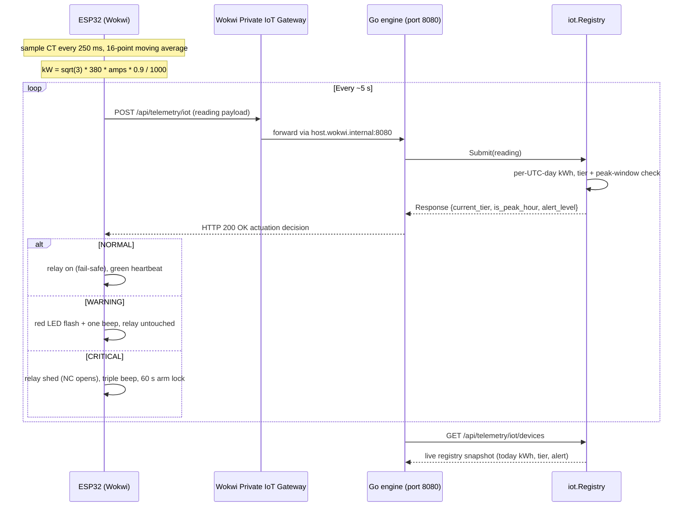
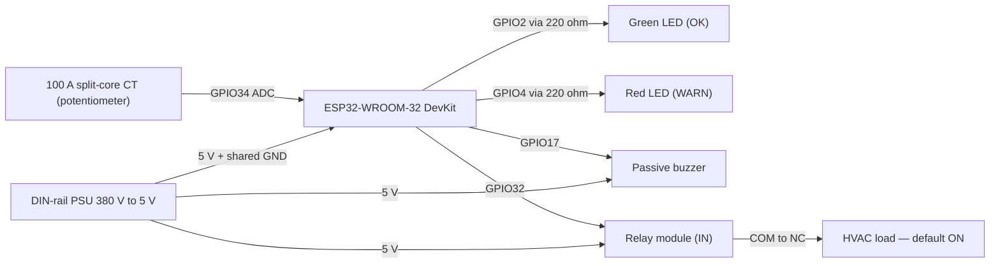

<div align="center">

# EcoPulse AI — نبض البيئة الذكي

**Energy Analytics · Peak-Hours Optimization · Carbon Footprint Tracking**

A submission to the **National Smart Green Projects Initiative (SGG)** —
المبادرة الوطنية للمشروعات الخضراء الذكية
Fourth Cycle 2026 · Category 3: Small Local Projects (Individuals / Innovators) · Cairo, Egypt

[](https://github.com/ahmedthebest31/ecopulse-ai/actions/workflows/ci.yml)


</div>

> **Notice.** This repository is made visible **solely for evaluation** of the SGG
> submission above. Downloading, copying, modifying, redistributing, or any other
> use is **not permitted**. See [LICENSE](LICENSE).

---

## 1. The problem

A mid-sized commercial or industrial facility pays an Egyptian seven-tier progressive
tariff while carrying an invisible burden: standby loads running outside peak hours,
equipment degrading toward failure with no early warning, and carbon emissions that are
never measured at all.

## 2. What EcoPulse AI does

Four operational modules run on top of one measured data pipeline:

- **Tiered billing.** Exact electronic billing against the official seven-tier Egyptian
  tariff (rates effective September 2024: `0.68 → 2.23 EGP/kWh`), allocated sequentially,
  displayed in EGP and USD.
- **Peak detection & load shifting.** Magnitude-based critical-spike detection and a
  configurable peak window (`18:00–22:00` default), quantifying the shiftable load.
- **Predictive maintenance.** Gradual micro-surge detection grouped into per-equipment
  maintenance alerts before failure happens.
- **AI executive reporting.** Deterministic Gemini-backed summaries (measured numbers
  only) with a fully offline bilingual fallback that was live-tested against the real API.

## 3. Architecture

- `data-generator/` — pure-stdlib Python 3.12 simulator (managed by `uv`): one minute of
  telemetry per facility over 24 hours, smooth day profiles, forced spikes and micro-surges,
  atomic writes, deep config validation, deterministic under a fixed seed.
- `backend-go/` — Go analytics engine built on the standard library only (**zero
  third-party dependencies**): REST API, tiered tariff engine, spike/maintenance analytics,
  Gemini client with locale fallback resources (Arabic never lives in source code).
- `frontend/` — React 19 + Vite 8 + TypeScript dashboard: full Arabic RTL / English LTR,
  five-step setup wizard, TanStack event table with CSV export, Recharts live chart,
  print-ready report view, WCAG-conscious keyboard and ARIA support.
- `hardware-sim/` — Wokwi ESP32 factory-area simulator: current transformer (potentiometer),
  voltage tap, load-shed relay, buzzer + LEDs, posting live telemetry into the Go engine and
  reacting to its actuation commands (see section 4).
- **Packaging** — one-click launchers for Windows (`run.ps1`), Linux and macOS (`run.sh`),
  and a production-ready single-container `Dockerfile` (nginx + Go API, dataset baked in).

```
generator.py ──▶ telemetry_data.json (8,640 records) ──▶ Go engine (:8080) ──▶ React dashboard (:5173)
     seed 42          6 facilities × 1,440 min              REST + CORS            AR/EN · dark/light
```

## 4. Hardware & IoT Simulation

A live two-way channel connects the factory floor to the analytics engine: a simulated
ESP32 (Wokwi) posts electrical readings every ~5 s, and the Go engine answers with an
actuation decision computed from the **same seven-tier tariff and peak-window policy** as
the dashboard. The device half lives in `hardware-sim/`; the backend half is the `iot`
registry (`backend-go/internal/iot`).

### The two-way loop



### Components and wiring

Every part in `hardware-sim/diagram.json` maps to a real, factory-buyable component
(`hardware-sim/hardware_bom.md`):



The potentiometer stands in for a 100 A split-core current transformer sampled every 250 ms
through a 16-point moving average; the firmware converts to kW with
`kW = √3 × 380 × amps × 0.9 / 1000` (three-phase 380 V) and integrates the result into kWh.
The loop is non-blocking (`millis()`-only, no bus-waiting), so reporting and actuation never
starve each other.

### What the engine decides

For each POST, the `iot` registry keeps a rolling per-device kWh total for the current UTC
day, maps it onto the official seven-tier Egyptian tariff, and applies the configured peak
window (default `18:00–22:00`, loaded from the telemetry dataset):

- `NORMAL` — the default state; `is_peak_hour` still reports whether the device is inside
  the window.
- `WARNING` — tier ≥ 6, or tier ≥ 4 inside peak hours.
- `CRITICAL` — tier ≥ 7, or tier ≥ 6 inside peak hours. Always dominates `WARNING`.
- `load_shed_recommended` is `true` exactly when `CRITICAL` or (peak hours and tier ≥ 6).

### Actuation on the device

- `CRITICAL` pulls the relay `IN` low, opening the COM–NC contact and shedding the HVAC load;
  the firmware triggers a triple beep and a fast red blink, then re-arms the relay only after
  a 60 s guard window.
- `WARNING` flashes the red LED slowly with a single beep; the relay stays untouched.
- `NORMAL` blinks the green LED as a heartbeat confirming each successful POST.
- The relay starts high (load-on) and stays high on any communication failure, so a dead link
  fails safe instead of dropping production load.

### JSON contract

Schema lives in `backend-go/internal/iot`. POST request body to `/api/telemetry/iot`:

```json
{ "device_id": "esp32-factory-001", "timestamp": "2026-08-03T18:30:00Z",
  "amperage": 42.5, "voltage": 380.0, "kilowatts": 25.2, "accumulated_kwh": 112.7 }
```

And the 200 OK response carrying the actuation decision:

```json
{ "status": "ok", "current_tier": 4, "is_peak_hour": true,
  "load_shed_recommended": false, "alert_level": "WARNING" }
```

`GET /api/telemetry/iot/devices` lists the live registry: per-device today kWh, current tier
and alert level, sorted by device id.

### Running the simulator on Wokwi

Quick start on the Wokwi web canvas:

1. Open `https://wokwi.com/projects/new/esp32`.
2. Replace the generated `diagram.json` with `hardware-sim/diagram.json`.
3. Replace the generated `sketch.ino` with `hardware-sim/sketch.ino`.
4. Start the Go engine locally so it listens on :8080 (`cd backend-go && go run ./cmd/server`),
   then press the play button. The firmware joins the open `Wokwi-GUEST` network and reaches
   the engine through Wokwi's Private IoT Gateway at `host.wokwi.internal:8080`.

VS Code alternative: install the Wokwi extension (`wokwi.wokwi-vscode`), open `hardware-sim/`
as a project, and run it from the extension panel — the extension bundles its own private
gateway. Physical hardware swaps `host.wokwi.internal` for the gateway's LAN IP in the
firmware's `BACKEND_HOST` and keeps everything else identical.

GitHub renders the Mermaid diagrams above natively, so no image assets are committed. The
hardware integration reference and the full telemetry contract also live in
`docs/IOT_HARDWARE_INTEGRATION.md`.

## 5. Measured results — one certified 24-hour cycle

Every number below is recomputed three independent ways (generator summary ==
independent Python recompute == live backend endpoint) from the seed-42 dataset.

### Consumption & billing

- Total energy: **16,369.01 kWh/day** across six facilities (three commercial, three industrial).
- Daily bill: **35,993.39 EGP = 742.13 USD** at the configurable reference rate `48.5 EGP/USD`.
- Effective price: **2.1989 EGP/kWh**, driven by the top-tier marginal rate:

$$\text{Bill}=\sum_{i=1}^{7} r_i \cdot \min\bigl(\max(0,\; k - L_i),\; W_i\bigr), \qquad k = 16{,}369.01 \text{ kWh}$$

- Sector split: commercial **4,142.79 kWh/day (25.31%)**, industrial **12,226.22 kWh/day (74.69%)**.

### Peak-hours exposure

- The peak window `18:00–22:00` covers only **16.67%** of the day yet carries
  **5,975.28 kWh = 36.50%** of daily energy — the directly actionable load-shifting margin:

$$\text{PeakShare} = \frac{\text{PeakEnergy}}{\text{TotalEnergy}} \times 100 = \frac{5{,}975.28}{16{,}369.01}\times100 = 36.50\%$$

- Maximum demand inside the window: **706.35 kW**.

### Carbon footprint

- Emission factor applied: `CO₂(kg) = kWh × 0.85` → **13,913.66 kg CO₂/day**.
- Annualized (`× 365`): **≈ 5,078.49 t CO₂/year**.
- Tree-equivalent offset at `21.77 kg CO₂/tree/year`: `⌈13,913.66 ÷ 21.77⌉ =` **640 trees/year**
  — exactly what the dashboard KPI shows.

### Anomaly detection ground truth

- Dataset injects **78 forced-spike records** and **280 micro-surge records** → **358 anomaly rows** total.
- Engine outcome: **18 critical spike runs** and **12 predictive-maintenance alerts**
  (30 operational events that previously went unobserved), matching the injected truth.

## 6. Modeled annual impact

Forward-looking figures are explicitly labeled *modeled*; every formula is shown so any
reviewer can recompute them from the measured baseline. Stated assumptions:

- Annualization: `daily × 365`.
- Efficiency engine captures 12% of consumption (standby loads, HVAC/lighting scheduling).
- Demand-charge model uses an illustrative `250 EGP/kW/month` (declared as such).
- Predictive maintenance avoids one `250,000 EGP` major failure per year across the fleet.

- Annual baseline: **5,974,689 kWh** costing **13,137,588 EGP ≈ 270,878 USD** per year.
- Engine 1 — efficiency (12%): `5,974,689 × 0.12 = 716,963 kWh` worth **1,576,511 EGP/year**,
  avoiding **609,418 kg CO₂** annually (`716,963 × 0.85`).
- Engine 2 — peak shifting: shiftable load `30% × 5,975.28 = 1,792.59 kWh/day`;
  demand-charge relief `706.35 × 0.15 = 105.95 kW` → **317,857 EGP/year** at the
  illustrative `250 EGP/kW/month`.
- Engine 3 — predictive maintenance: one avoided major failure (`250,000`) plus degraded-
  equipment recovery (`1.5% × bill = 197,064`) → **447,064 EGP/year**.

$$\text{Gross savings} = 1{,}576{,}511 + 317{,}857 + 447{,}064 = 2{,}341{,}432 \text{ EGP/yr} \;(48{,}277\ \text{USD})$$

- Operating-cost reduction: `2,341,432 ÷ 13,137,588 =` **17.8%** of the annual bill.
- Investment: capex **900,000 EGP** (6 × 150,000 gateways) + opex **90,000 EGP/year**.
- Payback: `900,000 ÷ 2,341,432 =` **0.38 years ≈ 4.6 months**.
- Year-1 ROI: `(2,341,432 − 90,000 − 900,000) ÷ 900,000 =` **150%**.
- Five-year cumulative net: **10,357,160 EGP ≈ 214,000 USD**.

## 7. Quick start

Prerequisites: Go 1.26+, Node 22+ with pnpm 11, Python 3.12 with uv.

### One-command launcher

```powershell
# Windows
.\run.ps1
```

```bash
# Linux / macOS
./run.sh
```

Both open the backend and frontend invisibly in the current terminal, mirror their
logs into `logs\{backend,frontend}.log`, and shut everything down if either server
crashes (or when you press Ctrl+C). The dataset is generated the first time and reused
afterwards:

```powershell
cd data-generator ; uv run python generator.py    # deterministic, seed 42
```

Or start each part manually:

```powershell
cd backend-go ; go run ./cmd/server
cd frontend   ; pnpm dev      # then open http://localhost:5173
```

The generator also accepts `--config`, `--seed`, and `--out-dir`; all writes are atomic.

### Docker (production-ready single container)

The bundled `Dockerfile` produces one self-contained image: the dashboard (nginx) and
the Go API behind it, with the validated dataset baked in. No local Go/Node toolchain is
needed — the image is built from source and runs on any Docker host:

```bash
docker build -t ecopulse-ai .
docker run -d -p 8080:80 -p 80:80 --name ecopulse ecopulse-ai
# open http://localhost
# check it:  curl -s http://localhost/api/health
# logs:      docker logs -f ecopulse
```

## 8. Verification

- Backend: `gofmt` clean, `go vet ./...` clean, `go test ./...` green across
  tariff / analytics / ai_report / iot / api packages.
- Generator: `uv run ruff check .` clean (E, F, W, I rules); smoke generation asserted
  at exactly `6 × 1,440 = 8,640` records with CSV parity.
- Frontend: `pnpm lint` and `pnpm build` clean.
- GitHub Actions CI runs all of the above on every push and pull request.

## 9. Documentation

Submission dossier for the Initiative (project proposal against the six official SGG
criteria, economic feasibility study, submission checklist) lives in `docs/`. The IoT
hardware integration reference and the full two-way telemetry contract are specified in
`docs/IOT_HARDWARE_INTEGRATION.md`.

## 10. License

Proprietary — evaluation use for the SGG initiative only. Copying, downloading,
modification, redistribution, and any other exploitation are prohibited.
See [LICENSE](LICENSE) for the full terms.
